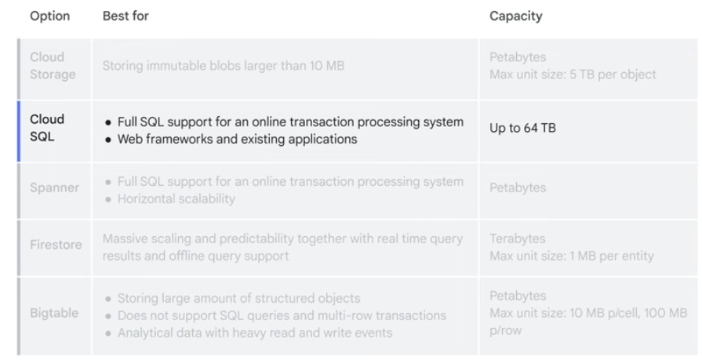

# 

## 

Google services can be categorised as
1. Compute
2. Storage
3. Big Data
4. Machine Learning
5. Application services

## 
Cloud computing is a way of using information technology that has this five equally important traits
1. Customers get computing resources that are on-demand and self-service
2. Customers get access to those resources over the internet, from anywhere
3. The provider of those resources allocates them to users out of that pool
4. Resources are elastic-which means they are flexible, so customers can be
5. Customers pay only for what yhey use, or reserve as they go.

### IaaS and PaaS

_IaaS: Infrastructure as a service offerings provide:
1. Raw compute
2. Storage
3. Network capabilities

_PaaS: Platform as a service offerings provide: bind code libraries to the infrastructure that the application needs. App engine is an example of PaaS.
 

In IaaS model, customer pay for what they allocated, while in PaaS model, customer pay for what they actually use.
 

Serverless services provided by google includes
1. _Cloud Run_: deploy containerized microservices based application in a fully managed environement
2. _Cloud Run Functions_: Manages event-driven code as a pay-as-you-go service

### 

It is based in 5 basic geographic locations: _North America_, _South America_, _Europe_, _Asia_, and _Austrilia_.
 
App location affects Availibility, Durability, and Latency

### 
1. Hardware infrastructure layer provides hardware design and provenance, secure boot stack, and premises security
2. Service deployment layer provides encryption of inter-service communication
3. User identity layer provide user identity
4. Storage service layer provides encryption at rest
5. Internet communication layer provides Google Front End (GFE), and Denial of service (DOS) protection
6. Operational Security layer provides intrusion dtection, reducing insider risk, employee universal second factor (U2F) use, and software development practices

[Google Security design](cloud.google.com/security/security-design)
[Google cloud price calculator](cloud.google.com/products/calculator)

## 

1. _Cloud VPN_ - To make the connection dynamic, a Google Cloud feature called Cloud Router can be used. It let’s other networks and Google VPC, exchange route information over the VPN using the Border Gateway Protocol. 

2. _Direct Peering_ - It means putting a router in the same public data center as Google point of presence and using it to exchange traffic between networks. 

3. _Carrier Peering_ - gives you direct access from on-premises network through a service provider’s network to Google workspace and to Google Cloud products that can be exposed through one or more public IP addresses. One downside of perring is that it isn’t covered by Google Service Level Agreement. 

4. _Dedicated Interconnect_ - Allows for one to more direct, private connections to Google. It can covered by up to a 99.99% SLA 

5. _Partner Interconnect_ - Useful if data center is in a physical location that can’t reach a dedicated interconnect colocation facility. Covered SLA 99.99% 

6. _Cross-Cloud Interconnect_ - Establish high-bandwidth dedicated connectivity between Google Cloud and another cloud service provider. It exists in two sizes 10m/s or 100m/s

##  

_Cloud Storage_ - is a service that offers developers and IT organizations durable and highly available object storage. Cloud storage also provides a feature called Autoclass, which automatically transitions objects to appropriate storage classes based on each object’s access pattern. Cloud storage classed includes 

1. _Standard storage_ - is considered best for frequently accessed or hot data. It’s also great for data that’s stored for only brief periods of time. 

2. _Nearline Storage_ - is best for storing infrequently acced data, like reading or modifying data on average once a month or less. 

3. _Coldline Storage_ - the low cost option for storing infrequently accessed data. Is meant for reading or modifying data, at most once every 90 days. 

4. _Archive Storage_ - the lowest cost option, used ideally for data archiving, online backup, and disaster recovery. 

There are several ways to bring data into cloud storage. 

1. Online Transfer using gcloud storage, which is the Cloud Storage command from the Cloud SDK 

2. Storage Transfer Service which enables you to import large amount of data into Cloud storage quickly and cost effectively. 

3. Transfer Appliance: which is rackable, high-capacity storage server that you can lease from Google Cloud. 

_Cloud SQL_: Offers fully managed relational databases, including MySQL, PostgreSQL, and SQL server as a service. 

_Spanner_: is a fully managed relational database service that scales horizontally, is strongly consistent, and speaks SQL. 

_Firestore_: data is stored in documents and then organized into collections. 

_Bigtable_: Bigtable is Google's NoSQL big data database service. It's the same database that powers many core Google services, including Search, Analytics, Maps, and Gmail. 

 
 
customer consider the Coldline storage class To save money on storing infrequently accessed data. 

## 

## 

## 

