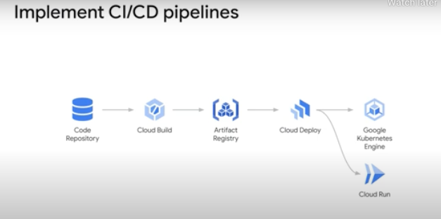
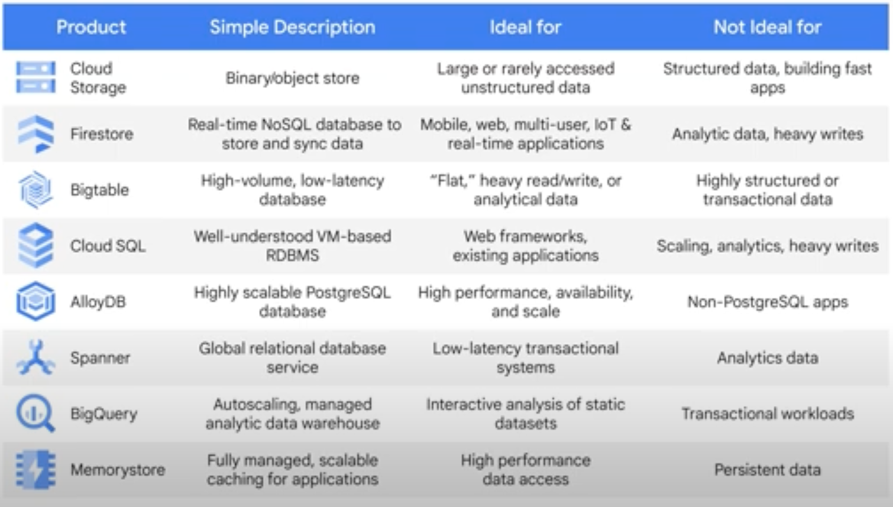
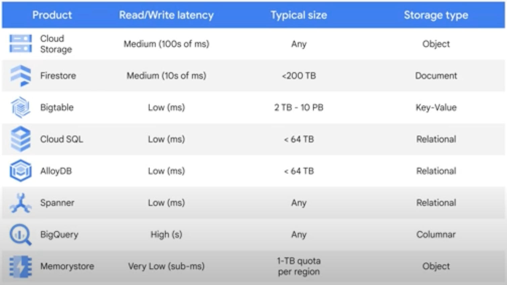

# Developing Applications with Google Cloud: Foundation

## Best Practices for Cloud Application Development

## Getting Started with Google Cloud Development

Google Cloud provides many platforms that you can use to build your applications. Your apps can benefit from many powerful services provided by Google Cloud. In this module, you learn how to access these services for your apps and scripts. You learn about Cloud APIs and the Google Cloud SDK, which let you programmatically include these features in your apps.

### Cloud APIs and the Google Cloud SDK

Cloud APIs and the Google Cloud SDK are used to interact with Google services. _Cloud APIs_ provide programmatic interfaces to Google Cloud services. You can use a Google Cloud resource or service in your application by calling a corresponding Cloud API. Cloud APIs let you use powerful features like compute, networking, storage, and machine learning in your applications. Cloud APIs can be called by using HTTP requests with JavaScript Object Notation, or JSON, payloads. They can also be called by using Google Remote Procedure Call, or gRPC, requests. To call Cloud APIs, the caller must supply application credentials.
 
The _Google Cloud SDK_ is used to interact with Google Cloud products and services. The SDK features are in two categories: command-line tools and language-specific Cloud Client Libraries. These tools and libraries use Cloud APIs to communicate with Google Cloud.

### Google Clod CLI

The Google Cloud Command Line Interface, or gcloud CLI, provides tools to manage Google Cloud services from the command line or in automated scripts. These tools provide the functionality of the Cloud APIs in an easy-to-use command-line interface.

Command line tools includes: _gcloud_ interacts with Google Cloud services, _gsutil_ manages Cloud Storage buckets and objects, and _bq_ runs queries and manages data in BigQuery. _gcloud storage_ performs better than gsutil, and its usage is similar to other gcloud commands.

### Cloud Client Libraries

Using a Cloud Client Library is easier than making direct API calls. The Cloud Client Libraries are the recommended method for accessing Google Cloud resources from your applications. The Cloud Client Libraries provide an optimized developer experience by handling low-level communication with the server, including authentication.

### Cloud Shell and Cloud Code

Cloud Shell is a free admin machine with browser-based command-line access that is used from the Google Cloud console. It provides you with a temporary virtual machine instance that has 5 GB of persistent disk storage.
You can use Cloud Code to help you develop your cloud applications in your favorite integrated development environment, or IDE. Cloud Code is a set of IDE plugins that make it easier to create, deploy, and debug cloud applications for Google Cloud. Cloud Code is available for the Cloud Shell Editor, Visual Studio Code, and the JetBrains IDEs, which include IntelliJ for Java and PyCharm for Python development.
 
Cloud Code for Kubernetes lets you develop your Kubernetes applications in your IDE. Cloud Code's Kubernetes Explorer provides you with an easy way to visualize and manage your Kubernetes resources within the IDE.
 
Cloud Workstations provides fully managed and secure cloud-based development environments for Google Cloud. Instead of requiring your developers to install software and run setup scripts, you can create a workstation configuration that specifies your environment in a reproducible way. evelopers can access fast and consistent development environments anytime and anywhere, using a browser, SSH, or a local IDE.

### Data Storage Options
_Cloud Storage and Databases_: You have a full range of cost-effective storage services to choose from when developing with Google Cloud. Cloud Storage is a unified object storage that lets you serve, analyze, and archive data anywhere in the world.
1. _Cloud Storage_: Cloud Storage is a unified object storage that lets you serve, analyze, and archive data anywhere in the world.
Objects are accessed by using HTTP requests, including ranged GETs to retrieve portions of the data. There is object metadata but the object itself is treated as unstructured bytes. 
The scale of the system allows for serving large static content and accepting user uploaded content including videos, photos, and files.
Objects can be up to 5 TB each. Cloud Storage is built for availability, durability, scalability, and consistency. It's an ideal solution for hosting static websites and storing images, videos, objects and blobs, and any unstructured data.

2. _Firestore_: Firestore is a fast, fully managed, serverless, NoSQL document database built for automatic scaling, high performance, and ease of application development. Firestore provides features such as: A strongly consistent storage layer, A hierarchical collection and document-based data model, Real-time updates and offline features, and Mobile and Web client libraries.
Firestore is built to scale and takes advantage of Google Cloud’s powerful infrastructure, with automatic scaling, in response to your application's load.
Firestore is an excellent choice for mobile and web apps, especially those that require flexible data storage or have external user accounts.
The data model for Firestore supports flexible, hierarchical data structures.

3. _Bigtable_: Bigtable is a high-performance, NoSQL database service. It’s a sparsely populated table that can scale to billions of rows and thousands of columns.
Bigtable can store terabytes to petabytes of data. Bigtable is built for fast key-value lookup and supports consistent sub-10ms latency. Bigtable is ideal for operational and analytical applications and is ideal for storing large amounts of single-keyed data and performing MapReduce operations.
Bigtable offers seamless scaling: changes to the deployment configuration are immediate, so there’s no downtime during reconfiguration.

4. _Cloud SQL_: Cloud SQL is Google Cloud’s managed relational database service. With Cloud SQL, Google manages replication, failover, and backups of your databases so you can focus on your MySQL, PostgreSQL, or SQL Server-compatible applications. Cloud SQL lets you easily configure replication and backups to protect your data.
You can replicate a primary instance to one or more read replicas. A read replica is a copy of the primary that reflects changes to the primary instance in almost-real time.

5. _AlloyDB_: AlloyDB is a fully managed, high performance PostgreSQL database service from Google Cloud. It combines the best of Google with PostgreSQL. AlloyDB is ideal for applications requiring high performance and PostgreSQL compatibility.
6. _Spanner_: Spanner is Google Cloud’s fully managed relational database service that offers both strong consistency and horizontal scalability. It's designed for mission-critical online transactional processing, or OLTP, applications. Spanner provides automatic, synchronous replication for high availability.
Spanner is built for multi-region replication and offers one of the highest SLAs in the industry: 99.999%. Spanner is ideal for applications with relational, structured, and semi-structured data that require high availability, strong consistency, and transactional reads and writes.
7. _BigQuery_: BigQuery is a fully managed, serverless enterprise data warehouse for analytics. BigQuery has built-in features like machine learning, geospatial analysis, and business intelligence. BigQuery can scan terabytes in seconds, and petabytes in minutes.
It's a great solution for Online Analytical Processing, or OLAP, workloads, for big data exploration and processing, and for reporting with Business Intelligence tools. Applications that you run on Google Cloud can achieve high levels of performance by using either Redis or Memcached without the burden of managing complex deployments.

 

### Handling Authentication and Authorization

With Identity and Access Management (IAM) and Identity Platform authentication, you have a simple and secure solution for authenticating and authorizing your application users.

1. _IAM authorizarion_: IAM lets you manage access control by defining who (the principal) has what access (role) for which resource. You can grant more granular access to Google Cloud resources by using the security principle of least privilege, which means that you should only grant access to resources that are necessary. You can specify who has access to your resources with IAM principals. A Google Account represents a developer, an administrator, or any other person who interacts with Google Cloud. A service account is an account for an application or compute workload instead of an individual end user.
 
A Google group is a named collection of Google Accounts and service accounts. Every Google group has a unique email address that's associated with the group. Google Groups are a convenient way to apply access controls to a collection of users.

#### Types of IAM Principals
1. Google Account (User)
2. Service account (application)
3. Google Group (Contains Google Accounts and service accounts)
4. Google workspace account (group of Google Account)
5. Cloud Identity Domain (group of Google Accounts)
 
You cannot assign a permission to a user directly. Instead, you grant the user a role. A role is a collection of permissions. When you grant a role to a user, you grant them all the permissions that the role contains.

#### Types of Role

[Roles](./images/types-of-roles.png)

2. _Authenticating to Google APIs and using service accounts_: IAM enables authorization for Google Cloud services, specifying what you're permitted to do. Authentication proves that you are who you say you are. You prove your identity by presenting some kind of credential.

#### Types of Authentication
1. Authenticating to Google services and resources.
2. Authenticating to apps and functions hosted on Google Cloud services like Cloud Run and Cloud Run functions.
3. Authenticate end users to your application
 
There are three ways to authorize API calls to Google services.

[Authorize API calls to Google services](./images/3-authorize-api.png)

3. _Choosing an Authentication Method_: 

[Choose authentication](./images/choose-authentication.png)
[Right authentication](./images/right-authentication.png)

Another way to provide access to users is to use Identity-Aware Proxy, or IAP. IAP controls access to your cloud applications running in your Google Cloud project. IAP verifies a user's identity and determines whether that user should be given access to the application based on configuration.
 

Firebase is an app development platform that helps you build mobile applications. Firebase Authentication provides features to help you add authentication and identity management to your mobile apps. Firebase Auth provides drop-in auth components that handle UI flows for sign-up and signing in and edge cases like account recovery.

### Adding Inteligence to your application

### Deploying Application

You learn the components of a continuous integration and delivery pipeline. You also learn how to build container images for your application by using Cloud Build, and how to push your images to Artifact Registry.

#### Continuous Integration and Delivery
A continuous integration and continuous delivery pipeline provides a stable, repeatable process for building and deploying your applications. Continuous integration occurs when developers commit their changes into a feature branch in a code repository, and a build service like Cloud Build is automatically triggered.
 
Google Cloud's Software Delivery Shield is a fully managed, end-to-end software supply chain security solution that protects every step of your CI/CD process. The Assured Open Source Software service lets you incorporate open Java and Python source packages that have been verified and tested by Google. These packages are built using Google's secure pipelines, and the packages are regularly scanned, analyzed, and tested for vulnerabilities.